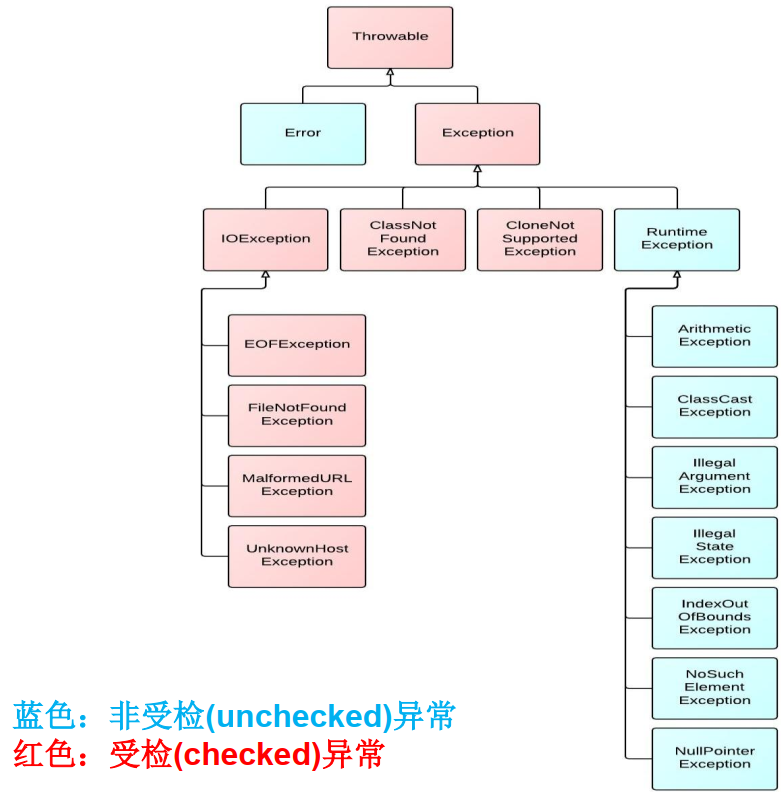
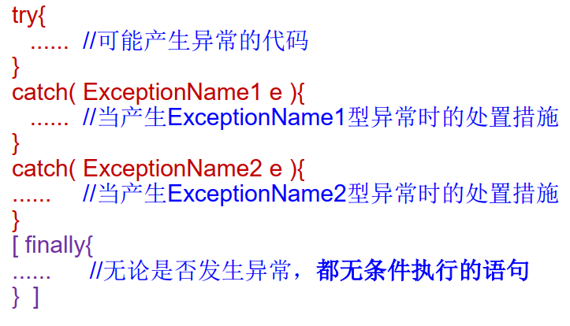
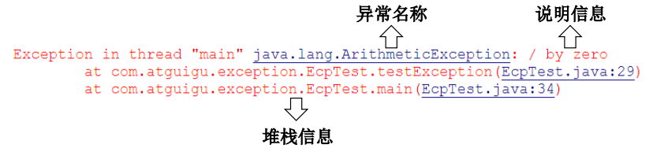
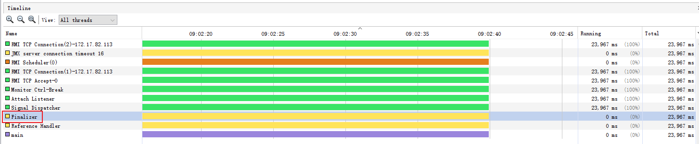

## 异常处理

### 1 异常概述与异常体系结构

* 异常：在Java语言中，将程序执行中发生的不正常情况称为“异常”。（开发过程中的语法错误和逻辑错误不是异常）

* Java程序在执行过程中所发生的的异常事件可分为两类：

  * <font color=blue>**Error**</font>：Java虚拟机无法解决的严重问题。如JVM系统内部错误、资源耗尽等严重情况。比如<font color=red>**StackOverflowError**</font>和<font color=red>**OOM**</font>。一般不编写针对性的代码进行处理。
  * <font color=blue>**Exception**</font>：其他因编程错误或偶然的外在因素导致的一般性问题，可以使用针对性的代码进行处理。例如：
    * 空指针访问
    * 试图读取不存在的文件
    * 网络连接中断
    * 数组角标越界

  ```java
  public class ErrorTest {
  	public static void main(String[] args) {
  		//1.栈溢出：java.lang.StackOverflowError
  //		main(args);
  		//2.堆溢出：java.lang.OutOfMemoryError 
  		Integer[] arr = new Integer[1024*1024*1024];
  		
  	}
  }
  ```

  * 对于这些错误，一般有两种<font color=red>**解决办法**</font>：一是遇到错误就终止程序的运行。另一种方法是由程序员在编写程序时，就考虑到错误的检测、错误消息的提示，以及错误的处理。
  * 捕获错误最理想的是在<font color=red>**编译期间**</font>，但是有的错误只有在<font color=red>**运行时**</font>才会发生，比如：<font color=red>**除数为0，数组下标越界**</font>等
    * 分类：<font color=red>**编译时异常**</font>和运行时异常

* Java异常体系结构

  ```mermaid
  graph RL
  Error --> Throwable
  Exception --> Throwable
  
  IOException --> Exception
  ClassNotFoundException --> Exception
  CloneNotSupportedException --> Exception
  RuntimeException --> Exception
  
  FileNotFoundException --> IOException
  EOFException --> IOException
  MalformedURLException --> IOException
  UnknownHostException --> IOException
  
  NullPointerException --> RuntimeException
  IndexOutOfBoundsException --> RuntimeException
  ArithmeticException --> RuntimeException
  ClassCastException --> RuntimeException
  IllegalArgumentException --> RuntimeException
  ... --> RuntimeException
  ```

  

  * 运行时异常（即蓝色的非受检异常）
    * 是指编译器不要求强制处理的异常。一般是指编程时的逻辑错误，是程序员应该积极避免其出现的异常。<font color=red>**java.lang.RuntimeException**</font>类及它的子类都是运行时异常。
    * 对于这类异常，可以不做处理，因为这类异常很普遍，若全处理可能会对程序的可读性和运行效率产生影响。
  * 编译时异常
    * 是指编译器要求必须处置的异常。即程序在运行时由于外界因素造成的一般性异常。<font color=red>**编译器要求Java程序必须捕获或声明所有的编译时异常**</font>。
    * 对于这类异常，如果程序不处理，可能会带来意想不到的结果。

### 2 常见异常

* <font size=5 color=blue>***面试题：***</font>常见的异常都有哪些？

  ```java
   * java.lang.Throwable
   * 		|-----java.lang.Error:一般不编写针对性的代码进行处理。
   * 		|-----java.lang.Exception:可以进行异常的处理
   * 			|------编译时异常(checked)
   * 					|-----IOException
   * 						|-----FileNotFoundException
   * 					|-----ClassNotFoundException
   * 			|------运行时异常(unchecked,RuntimeException)
   * 					|-----NullPointerException
   * 					|-----ArrayIndexOutOfBoundsException
   *                  |-----ArithmeticException
   * 					|-----ClassCastException
   * 					|-----NumberFormatException
   * 					|-----InputMismatchException				
  ```

  * IOException

    ```java
    public class ExceptionTest{
    	public void test(){
    //		File file = new File("hello.txt");
    //		FileInputStream fis = new FileInputStream(file);
    //		
    //		int data = fis.read();
    //		while(data != -1){
    //			System.out.print((char)data);
    //			data = fis.read();
    //		}
    //		
    //		fis.cose();
    	}
    }
    ```

  * NullPointerException

    ```java
    public class ExceptionTest{
    	public void test(){
    //		int[] arr = null;
    //		System.out.println(arr[3]);
    		
    		String str = "abc";
    		str = null;
    		System.out.println(str.charAt(0));
    	}
    }
    ```

  * IndexOutOfBoundsException

    ```java
    public class ExceptionTest{
    	public void test(){
    		//ArrayIndexOutOfBoundsException
    //		int[] arr = new int[10];
    //		System.out.println(arr[10]);
    		//StringIndexOutOfBoundsException
    		String str = "abc";
    		System.out.println(str.charAt(3));
    	}
    }
    ```

  * ArithmeticException

    ```java
    public class ExceptionTest{
    	public void test(){
    		int a = 10;
    		int b = 0;
    		System.out.println(a / b);
    	}
    }
    ```

  * ClassCastException

    ```java
    public class ExceptionTest{
    	public void test(){
    		Object obj = new Date();
    		String str = (String)obj;
    	}
    }
    ```

  * NumberFormatException

    ```java
    public class ExceptionTest{
    	public void test(){
    		String str = "123";
    		str = "abc";
    		int num = Integer.parseInt(str);
    	}
    }
    ```

  * InputMismatchException

    ```java
    public class ExceptionTest{
    	public void test(){
    		Scanner scanner = new Scanner(System.in);
    		int score = scanner.nextInt();
    		System.out.println(score);
    		
    		scanner.close();
    	}
    }
    ```

### 3 异常处理机制一：try-catch-finally

* Java提供的是异常处理的<font color=blue>**抓抛模型**</font>。

  * 过程一：“抛”：程序运行过程中，一旦出现异常，就会在异常代码处生成一个异常类的对象。并将此对象抛出。一旦抛出对象后，程序就不在运行。

    * 关于异常对象的产生

      ① 系统自动生成的异常对象

      ② 手动生成一个异常对象，并在程序内部抛出（throw）

  * 过程二：“抓”：可以理解为异常的处理方式

    ① try-catch-finally

    ② throws

* Java程序的执行过程中如出现异常，会生成一个<font color=red>**异常类对象**</font>，该异常对象将被提交给Java运行时系统，这个过程称为<font color=red>**抛出（throw）异常**</font>。

* 异常对象的生成

  * 由虚拟机<font color=red>**自动生成**</font>：程序运行过程中，虚拟机检测到发生了一些问题，若果在当前代码中没有找到相应的处理程序，就会在后台自动创建一个对应异常类的实例对象并抛出------自动抛出。
  * 由开发人员<font color=red>**手动创建**</font>：Exception exception = new ClassCastException();------创建好的异常对象不抛出对程序没有任何影响，和创建的普通对象一样。

* 为了保证程序的正常运行，代码必须对可能出现的异常进行处理。

* 如果一个方法内抛出异常，该异常对象会被抛给调用者方法中处理。如果异常没有在调用者方法中处理， 它继续被抛给这个调用方法的上层方法。 这个过程将一直继续下去， 直到异常被处理。这一过程称为  <font color=red>**捕获（catch）异常**</font>。

* 如果一个异常回到main()方法， 并且main()也不处理， 则程序运行终止。

* 程序员通常只能处理Exception， 而对Error无能为力。

* 异常处理通常是通过try-catch-finally语句实现的：

  

  * <font color=red>**try**</font>

    * 捕获异常的第一步是用try{…}语句块选定捕获异常的范围， 将可能出现异常的代码放在try语句块中。

  * <font color=red>**catch**</font>

    * 在catch语句块中是对<font color=red>**异常对象**</font>进行处理的代码。 每个try语句块可以伴随一个或<font color=red>**多个**</font>catch语句， 用于处理可能产生的<font color=red>**不同类型**</font>的异常对象。

    * <font color=green>**如果明确知道产生的是何种异常， 可以用该异常类作为catch的参数；也可以用其父类作为catch的参数。**</font>比 如 ： 可 以 用 ArithmeticException 类 作 为 参 数 的 地 方 ， 就 可 以 用RuntimeException类作为参数， 或者用所有异常的父类Exception类作为参数。但不能是与ArithmeticException类无关的异常， 如NullPointerException（ catch中的语句将不会执行） 。  

    * 捕获异常的有关信息：与其它对象一样，可以访问一个异常对象的成员变量或调用它的方法。

      * getMessage() 获取异常信息，返回字符串
      * printStackTrace() 获取异常类名和异常信息，以及异常出现在程序中的位置。返回值void。  

      

  * <font color=red>**finally**</font>

    * 捕获异常的最后一步是通过finally语句为异常处理提供一个统一的出口，使得在控制流转到程序的其它部分以前，能够对程序的状态作统一的管理。
    * <font color=red>**不论在try代码块中是否发生了异常事件， catch语句是否执行， catch语句是否有异常， catch语句中是否有return，finally块中的语句都会被执行。 **</font>
    * finally语句和catch语句是任选的
    * 像数据库连接、输入输出流、网络编程Socket等资源，JVM是不能自动回收的，我们需要自己手动的进行资源的释放。此时资源的释放，就需要声明在finally中。

---

* 使用的异常都是<font color=red>**RuntimeException**</font>类或是它的子类，这些类的异常的特点是：即使没有使用try和catch捕获， Java自己也能捕获，并且编译通过( 但运行时会发生异常使得程序运行终止 )。
* 如果抛出的异常是IOException等类型的非运行时异常，则<font color=blue>**必须捕获，否则编译错误**</font>。也就是说，我们必须处理编译时异常，将异常进行捕捉，转化为运行时异常。

### 4 异常处理机制二：throws

* **声明抛出异常是Java中处理异常的第二种方式**

  * 如果一个方法(中的语句执行时)可能生成某种异常， 但是并不能确定如何处理这种异常， 则此方法应<font color=red>**显示地**</font>声明抛出异常， 表明该方法将不对这些异常进行处理，而由该方法的<font color=red>**调用者**</font>负责处理。
  * 在方法声明中用<font color=red>**throws**</font>语句可以声明抛出异常的列表， throws后面的异常类型可以是方法中产生的异常类型， 也可以是它的父类。

* 声明抛出异常举例：

  ```java
  public void readFile(String file) throws FileNotFoundException {
      ......
      // 读文件的操作可能产生FileNotFoundException类型的异常
      FileInputStream fis = new FileInputStream(file);
      ......
  }
  ```

* **重写方法声明抛出异常的原则**

  * 重写方法不能抛出比被重写方法范围更大的异常类型。 在多态的情况下，对methodA()方法的调用-异常的捕获按父类声明的异常处理。  

  ```java
  public class OverrideTest {
      public static void main(String[] args) {
          OverrideTest test = new OverrideTest();
          test.display(s);
      }
      
      public void display(SuperClass s) {
          try {
              s.method();
          } catch (IOException) {
              e.printStackTrace();
          }
      }
  }
  
  class SuperClass {
      public void method() throws IOException { }
  }
  
  class SubClass extends SuperClass {
      public void method() throws FileNotFoundException { }
      // 如下写法是错误的，如果可以这样写，那么display就无法处理该错误了
      // public void method() throws Exception { }
  }
  ```

---

* <font size=5 color=blue>***面试题：***</font>开发中如何选择使用try-catch-finally 还是使用throws？
  * 如果父类中被重写的方法没有用throws方式处理异常，则子类重写的方法也不能使用throws，意味着如果子类重写的方法有异常，必须使用try-catch-finally方式处理。比如Thread中的run()方法。
  * 执行的方法a中，先后又调用了另外几个方法，这几个方法是递进关系的。我们建议这几个方法使用throws的方式处理。而执行的方法a可以考虑使用try-catch-finally进行处理。

### 5 手动抛出异常：throw

* Java异常类对象除在程序执行过程中出现异常时由系统自动生成并抛出， 也可根据需要使用人工创建并抛出。

  * 首先要生成异常类对象， 然后通过throw语句实现抛出操作(提交给Java运行环境)。

    ```java
    IOException e = new IOException();
    throw e;
    ```

  * 可以抛出的异常必须是Throwable或其子类的实例。 下面的语句在编译时将会产生语法错误：

    ```java
    throw new String("want to throw");
    ```

### 6 用户自定义异常类

* 如何自定义异常类？

  1. 继承现有的异常结构：RuntimeException、Exception
  2. 提供全局常量：serialVersionUID
  3. 提供重载的构造器

  ```java
  public class MyException extends RuntimeException {
      static final long serialVersionUID = 235787526725236L;
      
      public MyException() { }
      
      public MyException(String msg) {
          super(msg);
      }
  }
  ```

---

* <font size=5 color=blue>***面试题：***</font>final、finally、finalize的区别？

  * **final：关键字**

    * 具有不变性，因此保证了线程安全
    * 3种用法：修饰<font color=red>**变量、方法、类**</font>
      * final修饰<font color=red>**变量**</font>

        * 含义：被final修饰的变量，意味着<font color=red>**值不能被修改**</font>。如果变量是<font color=red>**对象**</font>，那么对象的<font color=red>**引用不能变**</font>，但是对象自身的<font color=red>**内容依然可以变化**</font>
        * <font color=red>**属性**</font>被声明为final后，该变量则<font color=red>**只能被赋值一次**</font>。且一旦被赋值，final的变量就<font color=red>**不能再被改变**</font>，无论如何也不会变
      * final修饰<font color=red>**方法**</font>

        * <font color=red>**构造方法**</font>不允许使用final修饰
        * <font color=red>**不可以被重写**</font>，也就是不能被<font color=red>**override**</font>，即便是子类有相同的名字的方法，那也不是override，这个和static方法一个道理
      * inal修饰<font color=red>**类**</font>

        * <font color=red>**不可被继承**</font>
        * 例如典型的<font color=red>**String类就是final**</font>的，我们从没见过哪个类是继承String的

  * **finally：关键字**

    * 捕获异常的最后一步是通过finally语句为异常处理提供一个统一的出口，使得在控制流转到程序的其它部分以前，能够对程序的状态作统一的管理。
    * <font color=red>**不论在try代码块中是否发生了异常事件， catch语句是否执行， catch语句是否有异常， catch语句中是否有return，finally块中的语句都会被执行。 **</font>
    * finally语句和catch语句是任选的
    * 像数据库连接、输入输出流、网络编程Socket等资源，JVM是不能自动回收的，我们需要自己手动的进行资源的释放。此时资源的释放，就需要声明在finally中。

  * **finalize：方法名**

    * Java语言提供了对象终止（finalization）机制来允许开发人员提供能<font color=blue>**对象被销毁之前的自定义处理逻辑**</font>。
    * 当垃圾回收器发现没有引用指向一个对象，即：垃圾回收此对象之前，总会先调用这个对象的finalize()方法。
    * finalize()方法允许在子类中被重写，<font color=blue>**用于在对象被回收之前进行资源释放**</font>。通常在这个方法中进行一些资源释放和清理工作，比如关闭文件、套接字和数据库连接等。
    * 永远不要主动调用某个对象的finalize()方法，应该交给垃圾回收机制调用。理由包括下面三点：
      * 在finalize()时可能会导致对象复活。
      * finalize()方法的执行时没有时间保障的，它完全由GC线程决定，极端情况下，若不发生GC，则finalize()方法将没有执行机会。
      * 一个糟糕的finalize()会严重影响GC的性能。
    * 从功能上来说，finalize()方法与C++中的析构函数比较相似，但是Java采用的是基于垃圾回收器的自动内存管理机制，所以finalize()方法在本质上不同于C++中的析构函数。

    ---

    * 由于finalize()方法的存在，<font color=blue>**虚拟机中的对象一般处于三种可能的状态**</font>。

      * 如果从所有的根节点都无法访问到某个对象，说明对象已经不再使用了。一般来说，次对象需要被回收，但事实上，也并不是“非死不可”的，这时候他们展示处于“缓刑”阶段。<font color=red>**一个无法触及的对象有可能在某一个条件下“复活”自己**</font>，如果这样，那么对它的回收就是不合理的，为此，定义虚拟机中的对象可能的三种状态。如下：
        * <font color=red>**可触及的**</font>：从根节点开始，可以到达这个对象。
        * <font color=red>**可复活的**</font>：对象的所有引用都被释放，但是对象有可能在finalize()中复活。
        * <font color=red>**不可触及的**</font>：对象的finalize()被调用，并且没有复活，那么就会进入不可触及状态。不可触及的对象不可能被复活，因为<font color=blue>**finalize()只会被调用一次**</font>。
      * 以上三种状态中，是由于finalize()方法的存在，进行的区分。只有在对象不可触及是才可能被回收。

    * 回收对象的具体过程：判断一个对象objA是否可回收，至少要经历两次编辑过程：

      1. 如果对象objA到GC Roots没有引用链，则进行第一次标记。

      2. 进行筛选，判断次对象是否有必要执行finalize()方法

         ① 如果对象objA没有重写finalize()方法，或者finalize()方法已经被虚拟机调用过，则虚拟机将会把finalize()方法视为“没有必要执行”，objA被判定为不可触及的。

         ② 如果对象onjA重写了finalize()方法，且还未执行过，那么objA会被插入F-Queue队列中，由一个虚拟机自动创建的、低优先级的Finalizer线程触发finalize()方法执行。

         

         ③ <font color=red>**finalize()方法是对象逃脱死亡的最后机会**</font>，稍后GC会对F-Queue队列中的对象进行第二次标记。<font color=blue>**如果objA在finalize()方法中与引用链上的任何一个对象建立了联系**</font>，那么在第二次标记时，objA会被移出“即将回收”集合。之后，对象会再次出现没有引用的情况。这种情况下，finalize()方法不会再次被调用，对象会直接编程不可触及的状态，也就是说，一个对象的finalize()方法只会被调用一次。

    * 代码演示

      ```java
      /**
       * 测试Object类中finalize()方法，即对象的finalization机制。
       */
      public class CanReliveObj {
          public static CanReliveObj obj;  // 类变量，属于 GC Root
      
          // 此方法只能被调用一次
          @Override
          protected void finalize() throws Throwable {
              super.finalize();
              System.out.println("调用当前类重写的finalize()方法");
              obj = this;  // 当前待回收的对象在finalize()方法中与引用链上的一个对象obj建立了联系
          }
      
          public static void main(String[] args) {
              try {
                  obj = new CanReliveObj();
                  // 对象第一次成功拯救自己
                  obj = null;
                  System.gc();  // 调用垃圾回收器
                  System.out.println("第1次 gc");
                  // 因为Finalizer线程优先级很低，暂停2秒，以等待它
                  Thread.sleep(2000);
                  if (obj == null) {
                      System.out.println("obj is dead");
                  } else {
                      System.out.println("obj is still alive");
                  }
                  System.out.println("第2次 gc");
                  // 下面这段代码与上面的完全相同，但是这次自救却失败了
                  obj = null;
                  System.gc();
                  // 因为Finalizer线程优先级很低，暂停2秒，以等待它
                  Thread.sleep(2000);
                  if (obj == null) {
                      System.out.println("obj is dead");
                  } else {
                      System.out.println("obj is still alive");
                  }
              } catch (InterruptedException e) {
                  e.printStackTrace();
              }
          }
      }
      ```

      **结果：**

      ​			调用当前类重写的finalize()方法

      ​			第1次 gc

      ​			obj is still alive

      ​			第2次 gc

      ​			obj is dead

* <font size=5 color=blue>***面试题：***</font>throw、throws的区别？
  * **throw**
    * 用于在程序内部生成异常对象
  * **throws**
    * 处理异常的一种方法（一共两种处理异常的方法，另一种是try-catch-finally），用于抛出异常

* <font size=5 color=blue>***面试题：***</font>Collection、Collections的区别？
* <font size=5 color=blue>***面试题：***</font>String、StringBuffer、StringBuilder的区别？
* <font size=5 color=blue>***面试题：***</font>ArrayList、LinkedList的区别？
* <font size=5 color=blue>***面试题：***</font>HashMap、LinkedHashMap的区别？
* <font size=5 color=blue>***面试题：***</font>重写、重载的区别？
  * 重写：子类重写父类的方法，为了实现多态
  * 重载：一个类中可以有多个重名函数，参数类型或者参数个数不同即可
* <font size=5 color=blue>***面试题：***</font>抽象类、接口的区别？
* <font size=5 color=blue>***面试题：***</font>==、equals()的区别？
* <font size=5 color=blue>***面试题：***</font>sleep()、wait()的异同？
  * 相同
    * 都会使线程进入阻塞状态，对应状态是Waiting或者TimeWaiting
    * 都会相应中断
  * 不同点
    * wait/notify必须在同步方法（synchronized）中执行，而sleep不需要；紧接着说这背后的原因：
      * 主要是为了让通信变得可靠，防止死锁或者永久等待的发生。假设wait，notify不需要放在同步代码块中，很有可能执行wait之前，线程切换到执行notify的线程，执行notify后再执行wait从而导致永久等待
      * sleep是专门针对当前线程的，和其他线程关系不大，因此不需要放到同步代码块中 
    * wait/notify释放锁，而sleep不释放锁
    * wait可以不传参，直到别人唤醒它；sleep必须传参
    * wait/notify属于Object类，sleep属于Thread类；紧接着说这背后的原因：
      * 因为wait()，notify()和notifyAll()是一个锁级别的操作，而这个锁是属于某个对象的，每一个对象的对象头中会有一些内容保存当前所得状态的；
      * 在实际的应用中，某个线程可能持有多把锁，比如主线程等待多个子线程准备完毕，如果wait()，notify()和notifyAll()定义在Thread中，则无法实现这样灵活的逻辑了


