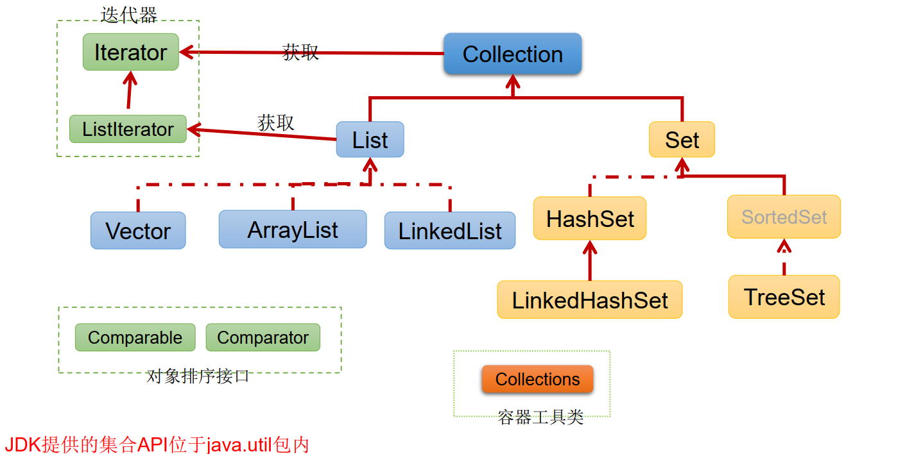
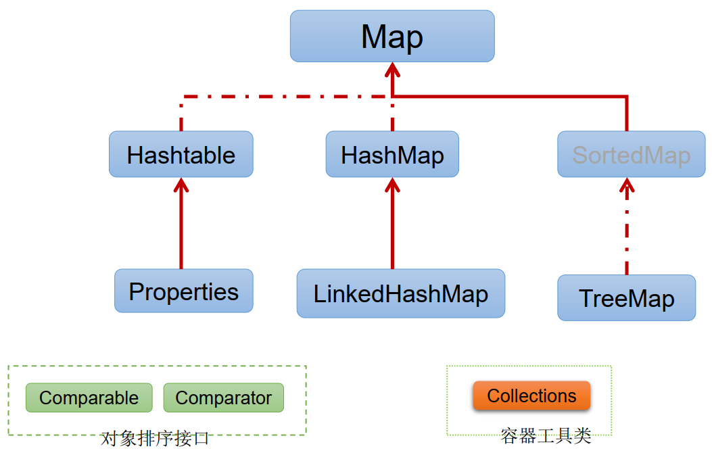

## 第11章 集合框架（20）

### 1 Java集合框架概述

* 集合、数组都是对多个数据进行存储操作的结构，简称Java容器。
  * 说明：此时的存储，主要指的是内存层面的存储，不涉及到持久化的存储（.txt,.jpg,.avi，数据库中）
* 数组
  * 数组在存储多个数据方面的特点：
    *  一旦初始化以后，其长度就确定了。
    *  数组一旦定义好，其元素的类型也就确定了。我们也就只能操作指定类型的数据了。
  * 数组在存储多个数据方面的<font color=red>**缺点**</font>：
    * 一旦初始化以后，其长度就不可修改。
    * 数组中提供的方法非常有限，对于添加、删除、插入数据等操作，非常不便，同时效率不高。
    * 获取数组中实际元素的个数的需求，数组没有现成的属性或方法可用
    *  数组存储数据的特点：有序、可重复。对于无序、不可重复的需求，不能满足。

---

* Java集合可分为Collection和Map两种体系

  * <font color=red>**Collection接口：**</font>单列数据，定义了存取一组对象的方法的集合

    * <font color=red>**List**</font>：元素有序、可重复的集合
    * <font color=red>**Set**</font>：元素无序、不可重复的集合

  * <font color=red>**Map接口**</font>：双列数据，保存具有映射关系的“key-value对”的集合

    ```java
     *   集合框架
     *      |----Collection接口：单列集合，用来存储一个一个的对象
     *          |----List接口：存储有序的、可重复的数据。  -->“动态”数组
     *              |----ArrayList、LinkedList、Vector
     *
     *          |----Set接口：存储无序的、不可重复的数据   -->高中讲的“集合”
     *              |----HashSet、LinkedHashSet、TreeSet
     *
     *      |----Map接口：双列集合，用来存储一对(key - value)一对的数据   -->高中函数：y = f(x)
     *              |----HashMap、LinkedHashMap、TreeMap、Hashtable、Properties
    ```

    

    

### 2 Collection接口方法


### 3 Iterator迭代器接口


### 4 Collection子接口一：List


### 5 Collection子接口二：Set


### 6 Map接口


### 7 Collections工具类


