## 第13章 IO流（25）

### 1 File类的使用

* File类的一个对象，代表一个文件或文件目录（俗称：文件夹）

* File类声明在java.io包下

* 如何创建File类的实例

  ```java
  /*
  	1.如何创建File类的实例
          File(String filePath)
          File(String parentPath,String childPath)
          File(File parentFile,String childPath)
  
      2.
      相对路径：相较于某个路径下，指明的路径。
      绝对路径：包含盘符在内的文件或文件目录的路径
  
      3.路径分隔符
       windows:\\
       unix:/
  */
  @Test
  public void test1() {
      //构造器1
      File file1 = new File("hello.txt");//相对于当前module
      File file2 = new File("D:\\workspace_idea1\\JavaSenior\\day08\\he.txt");
  
      System.out.println(file1);
      System.out.println(file2);
  
      //构造器2：
      File file3 = new File("D:\\workspace_idea1", "JavaSenior");
      System.out.println(file3);
  
      //构造器3：
      File file4 = new File(file3, "hi.txt");
      System.out.println(file4);
  }
  ```

  **结果：**

  ​			hello.txt

  ​			D:\workspace_idea1\JavaSenior\day08\he.txt

  ​			D:\workspace_idea1\JavaSenior

  ​			D:\workspace_idea1\JavaSenior\hi.txt

* File类的使用：常用方法

  * File类的获取功能

    ```java
    public String getAbsolutePath(){}  // 获取绝对路径
    public String getPath(){}  // 获取路径
    public String getName(){}  // 获取名称
    public String getParent(){}  // 获取上层文件目录路径。若无，返回null
    public long length(){}  // 获取文件长度（即字节数）。不能获取目录的长度
    public long lastModified(){}  // 获取最后一次修改值，毫秒值
    
    // 如下的两个方法适用于文件目录
    public String[] list(){}  // 获取指定目录下的所有文件或者文件目录的名称数组
    public File[] listFiles(){}  // 获取指定目录下的所有文件或者文件目录的File数组
    ```

  * File类的重命名功能

    ```java
    public boolean renameTo(File dest){}  // 把文件重命名为指定的文件路径
    ```

    ```java
    /*
        public boolean renameTo(File dest):把文件重命名为指定的文件路径
         比如：file1.renameTo(file2)为例：
            要想保证返回true,需要file1在硬盘中是存在的，且file2不能在硬盘中存在，且file2所在的目录存在。
         */
    @Test
    public void test4() {
        File file1 = new File("hello.txt");
        File file2 = new File("D:\\io\\hi.txt");
    
        boolean renameTo = file2.renameTo(file1);
        System.out.println(renameTo);
    
    }
    ```

  * File类的判断功能

    ```java
    public boolean isDirectory(){}  // 判断是否是文件目录
    public boolean isFile(){}  // 判断是否是文件
    public boolean exists(){}  // 判断是否存在
    public boolean canRead(){}  // 判断是否可读
    public boolean canWrite(){}  // 判断是否可写
    public boolean isHidden(){}  // 判断是否隐藏
    ```

  * File类的创建功能

    ```java
    public boolean createNewFile(){}  // 创建文件。若文件存在，则不创建，返回false
    public boolean mkdir(){}  // 创建文件目录。如果此文件目录存在，就不创建了。如果此文件目录的上层目录不存在，也不创建。
    public boolean mkdirs(){}  // 创建文件目录。如果上层文件目录不存在，一并创建
    ```

    <font color=red>**注意事项：如果你创建文件或者文件目录没有写盘符路径，那么，默认在项目路径下。**</font>

  * File类的删除功能

    ```java
    public boolean delete(){}  // 删除文件或者文件夹
    ```

    <font color=blue>**删除注意事项：**</font>Java中的删除不走<font color=blue>**回收站**</font>。

    要删除文件目录，请注意该文件目录下不能包含文件或者文件目录。

  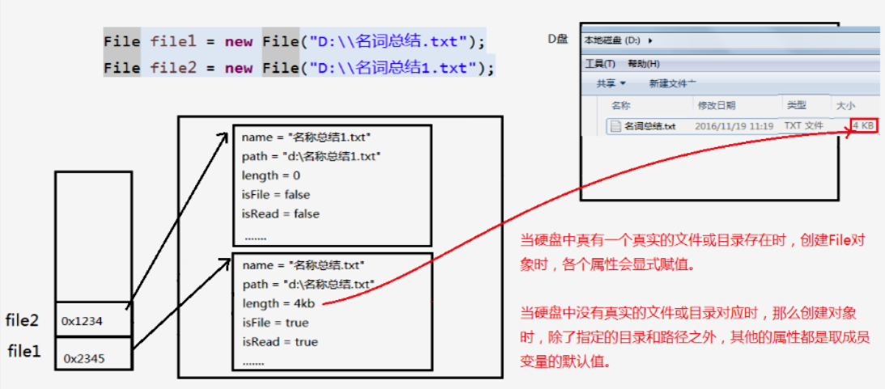

### 2 IO流原理及流的分类

* Java I/O 原理

  * I/O 是Input/Output的缩写，I/O 技术是非常实用的技术，用于<font color=red>**处理设备之间的数据传输**</font>。如读/写文件，网络通信等。

  * Java程序中，对于数据的输入/输出操作以<font color=red>**“流（stream）”**</font>的方式进行。

  * java.io包下提供了各种“流”类和接口，用以获取不同种类的数据，并通过<font color=red>**标准的方法**</font>输入或输出数据。

  * **输入input：**读取外部数据（磁盘、光盘等存储设备的数据）到程序（内存）中。

  * **输出output：**将程序（内存）数据输出到磁盘、光盘等存储设备中。

    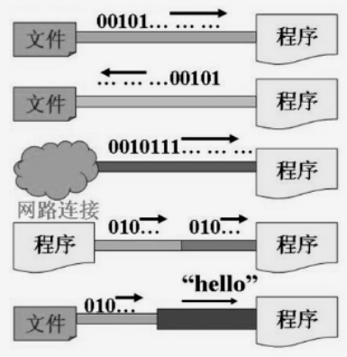

---

* 流的分类

  * 按操作<font color=red>**数据单位**</font>不同分为：**字节流（8 bit），字符流（16 bit）**
  * 按数据流的<font color=red>**流向**</font>怒通分为：**输入流，输出流**
  * 按流的<font color=red>**角色**</font>的不同分为：**节点流，处理流**

  | （抽象基类） |    字节流    | 字符流 |
  | :----------: | :----------: | :----: |
  |    输入流    | InputStream  | Reader |
  |    输出流    | OutputStream | Writer |

  1. Java的 IO 流供涉及40多个类，实际上非常规则，都是从如上4个抽象基类派生的。
  2. 由着四个类派生出来的子类名称都是以其父类名作为子类名后缀。

  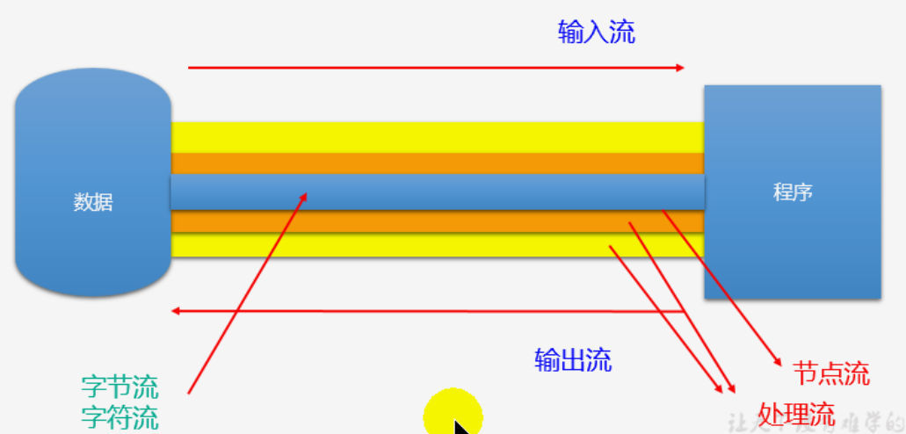

---

* IO流体系结构

  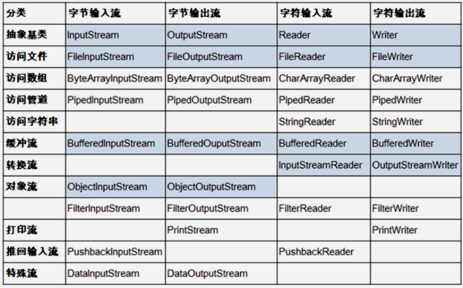

  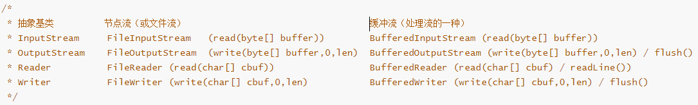

### 3 节点流（或文件流）

* 节点流：

  * 直接处理 File对象的流称为节点流，其他的称为处理流

  * 四种节点流

    ```
    FileInputStream
    FileOutputStream
    FileReader
    FileWriter
    ```

---

* FileReader 的基本使用（字符流）

  ```java
  /*
      将hello.txt文件内容读入程序中，并输出到控制台
      说明点：
      1. read()的理解：返回读入的一个字符。如果达到文件末尾，返回-1
      2. 异常的处理：为了保证流资源一定可以执行关闭操作。需要使用try-catch-finally处理
      3. 读入的文件一定要存在，否则就会报FileNotFoundException。
  */
  @Test
  public void testFileReader() {
      FileReader fr = null;
      try {
          // 1.实例化File类的对象，指明要操作的文件
          File file = new File("hello.txt");  // 相较于当前Module
          // 2.提供具体的流
          fr = new FileReader(file);
          // 3.数据的读入
          int data;
          while((data = fr.read()) != -1){
              System.out.print((char)data);
          }
      } catch (IOException e) {
          e.printStackTrace();
      } finally {
          // 4.资源的关闭
          try {
              if(fr != null)
                  fr.close();
          } catch (IOException e) {
              e.printStackTrace();
          }
      }
  }
  ```

* FileReader 的使用（字符流）：多上述代码read的重载

  ```java
  @Test
  public void testFileReader1() {
      FileReader fr = null;
      try {
          // 1.实例化File类的对象，指明要操作的文件
          File file = new File("hello.txt");  // 相较于当前Module
          // 2.提供具体的流
          fr = new FileReader(file);
          // 3.数据的读入
          char[] cbuf = new char[5];
          int len;  // 每次读取文件中字符的个数
          while ((len = fr.read(cbuf)) != -1) {
              for (int i = 0; i < len; i++) {
                  System.out.print(cbuf[i]);
              }
          }
      } catch (IOException e) {
          e.printStackTrace();
      } finally {
          // 4.资源的关闭
          try {
              if(fr != null)
                  fr.close();
          } catch (IOException e) {
              e.printStackTrace();
          }
      }
  }
  ```

* FileWriter 的使用（字符流）

  ```java
  /*
      从内存中写出数据到硬盘的文件里。
  
      说明：
      1. 输出操作，对应的File可以不存在的。并不会报异常
      2.
           File对应的硬盘中的文件如果不存在，在输出的过程中，会自动创建此文件。
           File对应的硬盘中的文件如果存在：
                  如果流使用的构造器是：FileWriter(file, false) / FileWriter(file):对原有文件的覆盖
                  如果流使用的构造器是：FileWriter(file, true): 不会对原有文件覆盖，而是在原有文件基础上追加内容
  */
  @Test
  public void testFileWriter() {
      FileWriter fw = null;
      try {
          // 1.提供File类的对象，指明写出到的文件
          File file = new File("hello1.txt");
          // 2.提供FileWriter的对象，用于数据的写出
          fw = new FileWriter(file,false);
          // 3.写出的操作
          fw.write("I have a dream!\n");
          fw.write("you need to have a dream!");
      } catch (IOException e) {
          e.printStackTrace();
      } finally {
          // 4.流资源的关闭，FileReader那种方式关闭也行
          if(fw != null){
              try {
                  fw.close();
              } catch (IOException e) {
                  e.printStackTrace();
              }
          }
      }
  }
  ```

* 实现文本文件的复制（字符流）

  ```java
  @Test
  public void testFileReaderFileWriter() {
      FileReader fr = null;
      FileWriter fw = null;
      try {
          // 1.创建File类的对象，指明读入和写出的文件
          File srcFile = new File("hello.txt");
          File destFile = new File("hello2.txt");
  
          // 不能使用字符流来处理图片等字节数据
          // File srcFile = new File("爱情与友情.jpg");
          // File destFile = new File("爱情与友情1.jpg");
  
          // 2.创建输入流和输出流的对象
          fr = new FileReader(srcFile);
          fw = new FileWriter(destFile);
          // 3.数据的读入和写出操作
          char[] cbuf = new char[5];
          int len;  // 记录每次读入到cbuf数组中的字符的个数
          while((len = fr.read(cbuf)) != -1){
              // 每次写出len个字符
              fw.write(cbuf, 0, len);
          }
      } catch (IOException e) {
          e.printStackTrace();
      } finally {
          try {
              if(fw != null)
                  fw.close();
          } catch (IOException e) {
              e.printStackTrace();
          }
  
          try {
              if(fr != null)
                  fr.close();
          } catch (IOException e) {
              e.printStackTrace();
          }
      }
  }
  ```

---

* 字符流不能用来处理文本文件，如下代码会发生错误

  ```java
  /*
   * 结论：
   * 1. 对于文本文件(.txt,.java,.c,.cpp)，使用字符流处理
   * 2. 对于非文本文件(.jpg,.mp3,.mp4,.avi,.doc,.ppt,...)，使用字节流处理
  */
  // 使用字节流FileInputStream处理文本文件，可能出现乱码。
  @Test
  public void testFileInputStream() {
      FileInputStream fis = null;
      try {
          // 1.造文件
          File file = new File("hello.txt");
          // 2.造流
          fis = new FileInputStream(file);
          // 3.读数据
          byte[] buffer = new byte[5];
          int len;  //记录每次读取的字节的个数
          while((len = fis.read(buffer)) != -1){
              String str = new String(buffer,0,len);
              System.out.print(str);
          }
      } catch (IOException e) {
          e.printStackTrace();
      } finally {
          if(fis != null){
              // 4.关闭资源
              try {
                  fis.close();
              } catch (IOException e) {
                  e.printStackTrace();
              }
          }
      }
  }
  ```

  文本文件内容是：helloworld123中国人

  输出结果：

  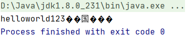

* FileInputStream、FileOutputStream的使用

  ```java
  // 实现对图片的复制操作
  @Test
  public void testFileInputOutputStream()  {
      FileInputStream fis = null;
      FileOutputStream fos = null;
      try {
          // 1.造文件
          File srcFile = new File("爱情与友情.jpg");
          File destFile = new File("爱情与友情2.jpg");
          // 2.造流
          fis = new FileInputStream(srcFile);
          fos = new FileOutputStream(destFile);
          // 3.读数据，处理
          byte[] buffer = new byte[5];
          int len;
          while((len = fis.read(buffer)) != -1){
              fos.write(buffer,0,len);
          }
      } catch (IOException e) {
          e.printStackTrace();
      } finally {
          // 4.关闭资源
          if(fos != null){
              try {
                  fos.close();
              } catch (IOException e) {
                  e.printStackTrace();
              }
          }
          if(fis != null){
              try {
                  fis.close();
              } catch (IOException e) {
                  e.printStackTrace();
              }
          }
      }
  }
  ```


### 4 缓冲流

* 缓冲流：是处理流的一种

  ```
   BufferedInputStream
   BufferedOutputStream
   BufferedReader
   BufferedWriter
  ```

  * 作用：提供流的读取、写入的速度

    * 提高读写速度的原因：内部提供了一个缓冲区

  * 处理流，就是“套接”在已有的流的基础上。

  * 实现文件的复制

    ```java
    // 实现文件复制的方法
    public void copyFileWithBuffered(String srcPath, String destPath) {
        BufferedInputStream bis = null;
        BufferedOutputStream bos = null;
    
        try {
            // 1.造文件
            File srcFile = new File(srcPath);
            File destFile = new File(destPath);
            // 2.造流
            // 2.1 造节点流
            FileInputStream fis = new FileInputStream((srcFile));
            FileOutputStream fos = new FileOutputStream(destFile);
            // 2.2 造缓冲流
            bis = new BufferedInputStream(fis);
            bos = new BufferedOutputStream(fos);
    
            // 3.复制的细节：读取、写入
            byte[] buffer = new byte[1024];
            int len;
            while ((len = bis.read(buffer)) != -1) {
                bos.write(buffer, 0, len);
            }
        } catch (IOException e) {
            e.printStackTrace();
        } finally {
            // 4.资源关闭
            // 要求：先关闭外层的流，再关闭内层的流
            if (bos != null) {
                try {
                    bos.close();
                } catch (IOException e) {
                    e.printStackTrace();
                }
            }
            if (bis != null) {
                try {
                    bis.close();
                } catch (IOException e) {
                    e.printStackTrace();
                }
            }
            // 说明：关闭外层流的同时，内层流也会自动的进行关闭。关于内层流的关闭，我们可以省略.
            // fos.close();
            // fis.close();
        }
    }
    ```

---

* 缓冲流：BufferedReader、BufferedWriter的使用

  ```java
  // 使用BufferedReader和BufferedWriter实现文本文件的复制
  @Test
  public void testBufferedReaderBufferedWriter() {
      BufferedReader br = null;
      BufferedWriter bw = null;
      try {
          // 创建文件和相应的流
          br = new BufferedReader(new FileReader(new File("dbcp.txt")));
          bw = new BufferedWriter(new FileWriter(new File("dbcp1.txt")));
  
          // 读写操作
          // 方式一：使用char[]数组
          // char[] cbuf = new char[1024];
          // int len;
          // while((len = br.read(cbuf)) != -1) {
          //     bw.write(cbuf,0,len);
          // }
  
          //方式二：使用String
          String data;
          while ((data = br.readLine()) != null) {
              bw.write(data);  // data中不包含换行符
              bw.newLine();  // 提供换行的操作
          }
      } catch (IOException e) {
          e.printStackTrace();
      } finally {
          // 关闭资源
          if (bw != null) {
              try {
                  bw.close();
              } catch (IOException e) {
                  e.printStackTrace();
              }
          }
          if (br != null) {
              try {
                  br.close();
              } catch (IOException e) {
                  e.printStackTrace();
              }
          }
      }
  }
  ```


### 5 转换流

* 转换流：是处理流的一种

  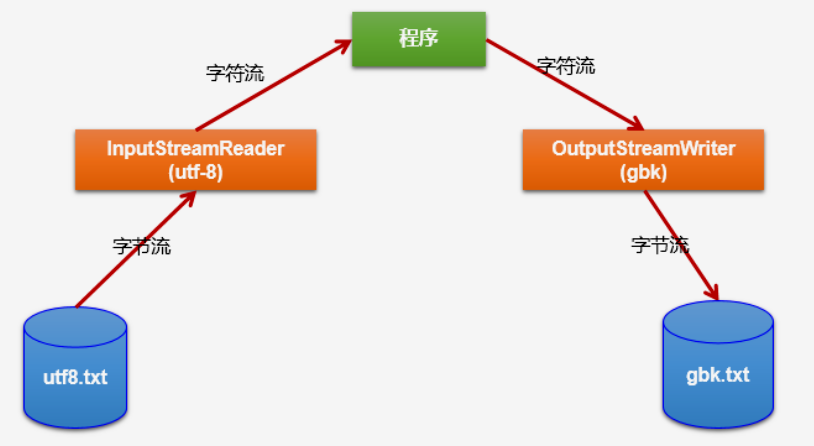

  * 类型

    ```
    InputStreamReader：将一个字节的输入流转换为字符的输入流
    OutputStreamWriter：将一个字符的输出流转换为字节的输出流
    ```

  * 作用：提供字节流与字符流之间的转换

  * 解码、编码

    * 解码：字节、字节数组  ---> 字符数组、字符串
    * 编码：字符数组、字符串 ---> 字节、字节数组

  * InputStreamReader使用举例

    ```java
    /*
        此时处理异常的话，仍然应该使用try-catch-finally
        InputStreamReader的使用，实现字节的输入流到字符的输入流的转换
         */
    @Test
    public void test1() throws IOException {
    
        FileInputStream fis = new FileInputStream("dbcp.txt");
        //        InputStreamReader isr = new InputStreamReader(fis);  // 使用系统默认的字符集
        // 参数2指明了字符集，具体使用哪个字符集，取决于文件dbcp.txt保存时使用的字符集
        InputStreamReader isr = new InputStreamReader(fis, StandardCharsets.UTF_8);  // 使用系统默认的字符集
    
        char[] cbuf = new char[20];
        int len;
        while ((len = isr.read(cbuf)) != -1) {
            String str = new String(cbuf, 0, len);
            System.out.print(str);
        }
    
        isr.close();
    }
    ```

  * InputStreamReader、OutputStreamWriter综合使用：编码转换 utf-8  ===> gbk

    ```java
    /*
        此时处理异常的话，仍然应该使用try-catch-finally
    
        综合使用InputStreamReader和OutputStreamWriter
         */
    @Test
    public void test2() throws Exception {
        // 1.造文件、造流
        File file1 = new File("dbcp.txt");
        File file2 = new File("dbcp_gbk.txt");
    
        FileInputStream fis = new FileInputStream(file1);
        FileOutputStream fos = new FileOutputStream(file2);
    
        InputStreamReader isr = new InputStreamReader(fis, "utf-8");
        OutputStreamWriter osw = new OutputStreamWriter(fos, "gbk");
    
        // 2.读写过程
        char[] cbuf = new char[20];
        int len;
        while ((len = isr.read(cbuf)) != -1) {
            osw.write(cbuf, 0, len);
        }
    
        // 3.关闭资源
        isr.close();
        osw.close();
    }
    ```

---

* 字符编码集的说明

  ```
  ASCII：美国标准信息交换码。用一个字节的7位可以表示。
  ISO8859-1：拉丁码表。欧洲码表。用一个字节的8位表示。
  GB2312：中国的中文编码表。最多两个字节编码所有字符
  GBK：中国的中文编码表升级，融合了更多的中文文字符号。最多两个字节编码
  Unicode：国际标准码，融合了目前人类使用的所有字符。为每个字符分配唯一的字符码。所有的文字都用两个字节来表示。
  UTF-8：变长的编码方式，可用1-4个字节来表示一个字符。
  ```

  * Unicode不完美，这里就有三个问题
    * 一：我们已经知道，英文字母只用一个字节表示就够了；
    * 二：如何才能区别Unicode和ASCII？计算机怎么知道两个字节表示一个符号，而不是表示两个符号呢？
    * 三：如果和GBK等双字节编码方式一样，用最高位是 1 或 0 表示两个字节和一个字节，就少了很多值无法用于表示字符，不够表示所有字符。Unicode在很长一段时间内无法推广，直到互联网的出现。
  * 面向传输众多UTF（UCS Transfer Format）标准出现了，顾名思义，<font color=blue>**UTF-8就是每次8个位传输数据，而UTF-16就是每次16个位。**</font>这是为传输而设计的编码，并使编码无国界，这样就可以显示全世界所有文化的字符了。
  * <font color=blue>**Unicode只是定义了一个庞大的、全球通用的字符集，并为每个字符规定了唯一确定的编号，具体存储什么样的字节流，取决于字符编码方案。**</font>推荐Unicode编码是UTF-8和UTF-16。

  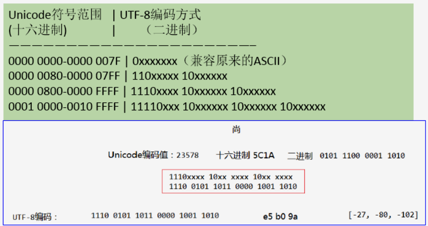

  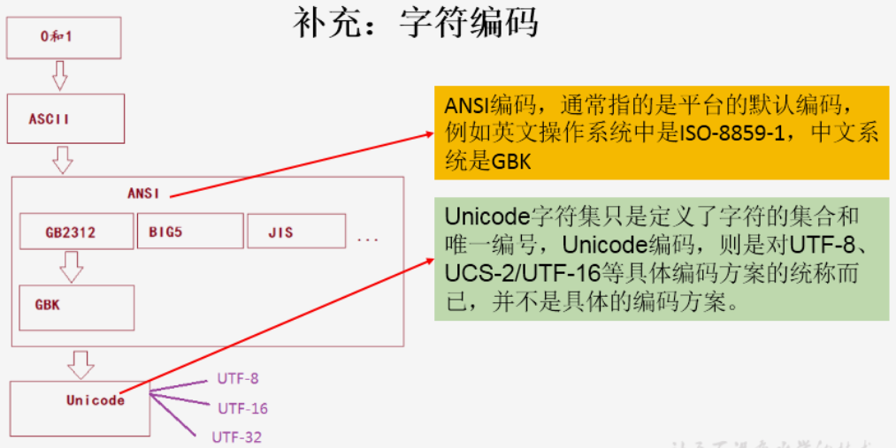

  * ANSI：美国国家标准学会（AMERICAN NATIONAL STANDARDS INSTITUTE: ANSI）

### 6 标准输入、输出流

```java
/*
    1.标准的输入、输出流
    	1.1
    	System.in:标准的输入流，默认从键盘输入
    	System.out:标准的输出流，默认从控制台输出
    	1.2
    	System类的setIn(InputStream is) / setOut(PrintStream ps)方式重新指定输入和输出的流。

    1.3练习：
    从键盘输入字符串，要求将读取到的整行字符串转成大写输出。然后继续进行输入操作，
    直至当输入“e”或者“exit”时，退出程序。

    方法一：使用Scanner实现，调用next()返回一个字符串
    方法二：使用System.in实现。System.in  --->  转换流 ---> BufferedReader的readLine()

*/
public static void main(String[] args) {
    BufferedReader br = null;
    try {
        InputStreamReader isr = new InputStreamReader(System.in);
        br = new BufferedReader(isr);

        while (true) {
            System.out.println("请输入字符串：");
            String data = br.readLine();
            if ("e".equalsIgnoreCase(data) || "exit".equalsIgnoreCase(data)) {
                System.out.println("程序结束");
                break;
            }

            String upperCase = data.toUpperCase();
            System.out.println(upperCase);

        }
    } catch (IOException e) {
        e.printStackTrace();
    } finally {
        if (br != null) {
            try {
                br.close();
            } catch (IOException e) {
                e.printStackTrace();
            }
        }
    }
}
```

运行结果：

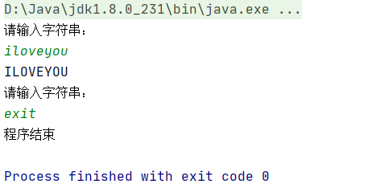

* 一个练习：写一个MyInput.java，要求包含如下方法：可以读入用户从键盘输入的 int、double、float、boolean、short、byte和Sting 类型。

  ```java
  public class MyInput {
      // Read a string from the keyboard
      public static String readString() {
          BufferedReader br = new BufferedReader(new InputStreamReader(System.in));
  
          // Declare and initialize the string
          String string = "";
  
          // Get the string from the keyboard
          try {
              string = br.readLine();
  
          } catch (IOException ex) {
              System.out.println(ex);
          }
  
          // Return the string obtained from the keyboard
          return string;
      }
  
      // Read an int value from the keyboard
      public static int readInt() {
          return Integer.parseInt(readString());
      }
  
      // Read a double value from the keyboard
      public static double readDouble() {
          return Double.parseDouble(readString());
      }
  
      // Read a byte value from the keyboard
      public static double readByte() {
          return Byte.parseByte(readString());
      }
  
      // Read a short value from the keyboard
      public static double readShort() {
          return Short.parseShort(readString());
      }
  
      // Read a long value from the keyboard
      public static double readLong() {
          return Long.parseLong(readString());
      }
  
      // Read a float value from the keyboard
      public static double readFloat() {
          return Float.parseFloat(readString());
      }
  
      public static void main(String[] args) {
          readInt();
      }
  }
  ```

  

### 7 打印流

* 打印流：实现将<font color=red>**基本数据类型**</font>的数据格式转化为<font color=red>**字符串**</font>输出。

```java
/*
    2. 打印流：PrintStream 和 PrintWriter
        2.1 提供了一系列重载的 print() 和 println()
        2.2 练习：实现打印流的重定向，重定向到文件中
    System.out返回的是PrintStream的实例
*/
@Test
public void test2() {
    PrintStream ps = null;
    try {
        FileOutputStream fos = new FileOutputStream(new File("D:\\IO\\text.txt"));
        // 创建打印输出流,设置为自动刷新模式(写入换行符或字节 '\n' 时都会刷新输出缓冲区)
        ps = new PrintStream(fos, true);
        if (ps != null) {// 把标准输出流(控制台输出)改成文件
            System.setOut(ps);
        }

        for (int i = 0; i <= 255; i++) { // 输出ASCII字符
            System.out.print((char) i);
            if (i % 50 == 0) { // 每50个数据一行
                System.out.println(); // 换行
            }
        }
    } catch (FileNotFoundException e) {
        e.printStackTrace();
    } finally {
        if (ps != null) {
            ps.close();
        }
    }
}
```


### 8 数据流

```java
/*
    3. 数据流
        3.1 DataInputStream 和 DataOutputStream
        3.2 作用：用于读取或写出基本数据类型的变量或字符串

    练习：将内存中的字符串、基本数据类型的变量写出到文件中。

    注意：处理异常的话，仍然应该使用try-catch-finally.
     */
@Test
public void test3() throws IOException {
    // 1.
    DataOutputStream dos = new DataOutputStream(new FileOutputStream("data.txt"));
    // 2.
    dos.writeUTF("刘建辰");
    dos.flush();  // 刷新操作，将内存中的数据写入文件
    dos.writeInt(23);
    dos.flush();
    dos.writeBoolean(true);
    dos.flush();
    // 3.
    dos.close();
}

/*
    将文件中存储的基本数据类型变量和字符串读取到内存中，保存在变量中。

    注意点：读取不同类型的数据的顺序要与当初写入文件时，保存的数据的顺序一致！
     */
@Test
public void test4() throws IOException {
    // 1.
    DataInputStream dis = new DataInputStream(new FileInputStream("data.txt"));
    // 2.
    String name = dis.readUTF();
    int age = dis.readInt();
    boolean isMale = dis.readBoolean();

    System.out.println("name = " + name);
    System.out.println("age = " + age);
    System.out.println("isMale = " + isMale);
    // 3.
    dis.close();
}
```


### 9 对象流

* 对象流：处理流的一种

  * 类型

    ```
    ObjectInputStream
    ObjectOutputStream
    ```

  * 用于存储和读取<font color=blue>**基本数据类型**</font>数据或<font color=blue>**对象**</font>的处理流。它的强大之处就是可以把Java中的对象写入到数据源中，也能把对象从数据源中还原回来。

  * ObjectInputStream和ObjectOutputStream不能序列化<font color=red>**static**</font>和<font color=red>**transient**</font>修饰的成员变量。

  * **序列化、反序列化**

    * 序列化：用ObjectOutputStream类<font color=blue>**保存**</font>基本数据类型或对象的机制
    * 反序列化：用ObjectInputStream类<font color=blue>**读取**</font>基本数据类型或对象的机制

---

* 对象的序列化

  * <font color=red>**对象序列化机制**</font>允许把内存中的Java对象转换成平台无关的二进制流。从而允许把这种二进制流持久地保存在磁盘上，或通过网络将这种二进制流传输到另一个网络节点。当其他程序获取了这种二进制流，就可以恢复到原来的Java对象。

  * 序列化的好处在于可将任何实现了Serializable接口的对象转化为<font color=red>**字节数据**</font>，使其在保存和传输时可被还原。

  * 序列化是RMI（Remote Method Invoke - 远程方法调用）过程的参数和返回值都必须实现的机制，而RMI是JavaEE的基础。

  * 如果需要让某个对象支持序列化机制，则必须让对象所属的类及属性是可序列化的，为了让某个类是可序列化的，该类必须实现如下两个接口之一。否则，会抛出NotSerializableException异常

    * <font color=red>**Serializable**</font>
    * Externalizable

  * 例子：利用对象流进行数据的序列化和反序列化

    ```java
    public class ObjectInputOutputStreamTest {
        /*
        序列化过程：将内存中的java对象保存到磁盘中或通过网络传输出去
        使用ObjectOutputStream实现
         */
        @Test
        public void testObjectOutputStream() {
            ObjectOutputStream oos = null;
    
            try {
                // 1.
                oos = new ObjectOutputStream(new FileOutputStream("object.dat"));
                // 2.
                oos.writeObject(new String("我爱北京天安门"));
                oos.flush();  // 刷新操作
    
                oos.writeObject(new Person("王铭", 23));
                oos.flush();
    
                oos.writeObject(new Person("张学良", 23, 1001, new Account(5000)));
                oos.flush();
            } catch (IOException e) {
                e.printStackTrace();
            } finally {
                if (oos != null) {
                    // 3.
                    try {
                        oos.close();
                    } catch (IOException e) {
                        e.printStackTrace();
                    }
                }
            }
        }
    
        /*
        反序列化：将磁盘文件中的对象还原为内存中的一个java对象
        使用ObjectInputStream来实现
         */
        @Test
        public void testObjectInputStream() {
            ObjectInputStream ois = null;
            try {
                ois = new ObjectInputStream(new FileInputStream("object.dat"));
    
                Object obj = ois.readObject();
                String str = (String) obj;
    
                Person p = (Person) ois.readObject();
                Person p1 = (Person) ois.readObject();
    
                System.out.println(str);
                System.out.println(p);
                System.out.println(p1);
            } catch (IOException e) {
                e.printStackTrace();
            } catch (ClassNotFoundException e) {
                e.printStackTrace();
            } finally {
                if (ois != null) {
                    try {
                        ois.close();
                    } catch (IOException e) {
                        e.printStackTrace();
                    }
                }
            }
        }
    }
    ```

    ```java
    /**
     * Person需要满足如下的要求，方可序列化
     * 1.需要实现接口：Serializable
     * 2.当前类提供一个全局常量：serialVersionUID
     * 3.除了当前Person类需要实现Serializable接口之外，还必须保证其内部所有属性
     *   也必须是可序列化的。（默认情况下，基本数据类型可序列化）
     *
     * 补充：ObjectOutputStream和ObjectInputStream不能序列化static和transient修饰的成员变量
     */
    
    public class Person implements Serializable{
    
        public static final long serialVersionUID = 475463534532L;
    
        private String name;
        private int age;
        private int id;
        private Account acct;
    
        public Person(String name, int age, int id) {
            this.name = name;
            this.age = age;
            this.id = id;
        }
    
        public Person(String name, int age, int id, Account acct) {
            this.name = name;
            this.age = age;
            this.id = id;
            this.acct = acct;
        }
    
        @Override
        public String toString() {
            return "Person{" +
                    "name='" + name + '\'' +
                    ", age=" + age +
                    ", id=" + id +
                    ", acct=" + acct +
                    '}';
        }
    
        public int getId() {
            return id;
        }
    
        public void setId(int id) {
            this.id = id;
        }
    
        public String getName() {
            return name;
        }
    
        public void setName(String name) {
            this.name = name;
        }
    
        public int getAge() {
            return age;
        }
    
        public void setAge(int age) {
            this.age = age;
        }
    
        public Person(String name, int age) {
    
            this.name = name;
            this.age = age;
        }
    
        public Person() {
    
        }
    }
    
    class Account implements Serializable{
        public static final long serialVersionUID = 4754534532L;
        private double balance;
    
        @Override
        public String toString() {
            return "Account{" +
                    "balance=" + balance +
                    '}';
        }
    
        public double getBalance() {
            return balance;
        }
    
        public void setBalance(double balance) {
            this.balance = balance;
        }
    
        public Account(double balance) {
    
            this.balance = balance;
        }
    }
    ```

  * 关于SerialVersionUID的说明

    * 凡是实现Serializable 接口的类都有一个表示序列化版本标识符的静态变量：

      * <font color=red>**private static final long SerialVersionUID;**</font>
      * SerialVersionUID用来表明类的不同版本间的兼容性。简言之，其目的是以序列化对象进行版本控制，有关各版本反序列化时是否兼容。
      * 如果类没有显示定义这个变量，它的值是Java运行时环境根据类的内部细节自动生成的。<font color=blue>**若类的实例变量做了修改，SerialVersionUID可能发生变化 **</font>。故建议，显式声明。

    * 简单来说，Java序列化机制是通过在运行时判断类的SerialVersionUID来检验版本的一致性的。在进行反序列化时，JVM会把传来的字节流中的SerialVersionUID与本地相应实体类的SerialVersionUID进行比较，如果相同就认为是一致的，可以进行反序列化，否则就会出现序列化版本不一致的异常。（InvalidCastException）

      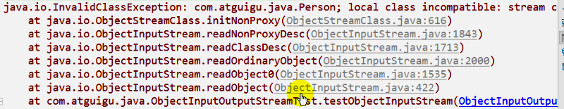

### 10 随机存取文件流

* 随机存取文件流：指的是RandomAccessFile类

* RandomAccessFile 声明在 java.io包下，但是直接继承java.lang.Object类。并且实现了DataInput、DataOutput这两个接口，也就意味着这个类既可以读也可以写

* RandomAccessFile 类支持“随机访问”的方式，程序可以直接跳到文件的任意位置来**读写文件**

  * 支持只访问文件的部分内容
  * 可以向已存在的文件后追加内容

* RandomAccessFile 对象包含一个记录指针，用以标示当前读写处的位置。

* RandomAccessFile 类对象可以自由移动记录指针：

  * <font color=red>**long getFilePointer()：**</font>获取文件记录指针的位置
  * <font color=red>**void seek(long pos)：**</font>将文件记录指针定位到 pos 位置

* 例子

  ```java
  public class RandomAccessFileTest {
      @Test
      public void test1() {
          RandomAccessFile raf1 = null;
          RandomAccessFile raf2 = null;
          try {
              // 1.
              raf1 = new RandomAccessFile(new File("爱情与友情.jpg"), "r");
              raf2 = new RandomAccessFile(new File("爱情与友情1.jpg"), "rw");
              // 2.
              byte[] buffer = new byte[1024];
              int len;
              while ((len = raf1.read(buffer)) != -1) {
                  raf2.write(buffer, 0, len);
              }
          } catch (IOException e) {
              e.printStackTrace();
          } finally {
              // 3.
              if (raf1 != null) {
                  try {
                      raf1.close();
                  } catch (IOException e) {
                      e.printStackTrace();
                  }
              }
              if (raf2 != null) {
                  try {
                      raf2.close();
                  } catch (IOException e) {
                      e.printStackTrace();
                  }
              }
          }
      }
  
      @Test
      public void test2() throws IOException {
          RandomAccessFile raf1 = new RandomAccessFile("hello.txt", "rw");
  
          raf1.seek(3);  // 将指针调到角标为3的位置
          raf1.write("xyz".getBytes());  //
  
          raf1.close();
      }
  
      /*
      使用RandomAccessFile实现数据的插入效果
       */
      @Test
      public void test3() throws IOException {
          RandomAccessFile raf1 = new RandomAccessFile("hello.txt", "rw");
  
          raf1.seek(3);  //将指针调到角标为3的位置
          // 保存指针3后面的所有数据到StringBuilder中
          StringBuilder builder = new StringBuilder((int) new File("hello.txt").length());
          byte[] buffer = new byte[20];
          int len;
          while ((len = raf1.read(buffer)) != -1) {
              builder.append(new String(buffer, 0, len));
          }
          // 调回指针，写入“xyz”
          raf1.seek(3);
          raf1.write("xyz".getBytes());
  
          // 将StringBuilder中的数据写入到文件中
          raf1.write(builder.toString().getBytes());
  
          raf1.close();
  
          // 思考：将StringBuilder替换为ByteArrayOutputStream
      }
  }
  ```

* 我们可以用RandomAccessFile这个类，来实现一个<font color=blue>**多线程断点下载**</font>的功能，用过下载工具的朋友都知道，下载前都会建立<font color=blue>**两个临时文件**</font>，一个是与被下载文件大小相同的空文件，另一个是记录文件指针的位置文件，每次暂停的时候，都会保存上一次的指针，然后断点下载的时候，会继续从上一次的地方下载，从而实现断点下载或上传的功能，有兴趣的朋友可以自己实现下。

### 11 NIO.2中Path、Paths、File类的使用

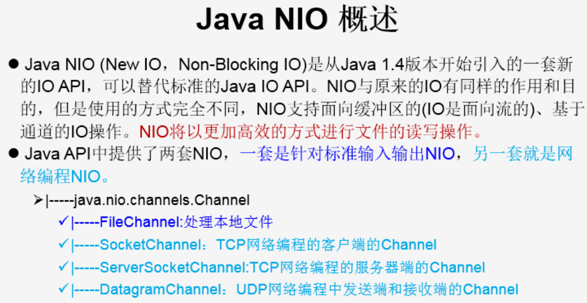

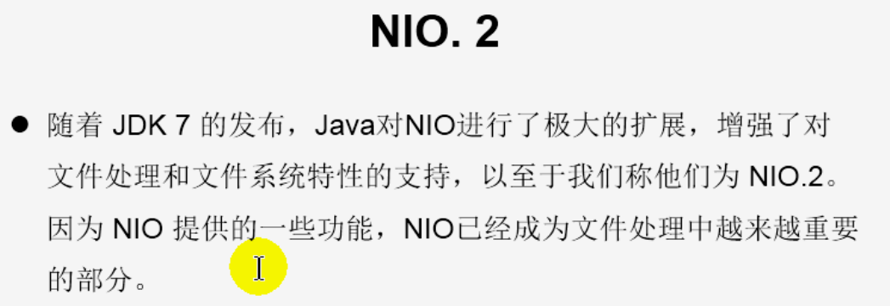

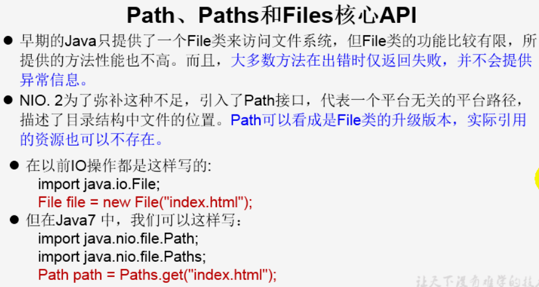

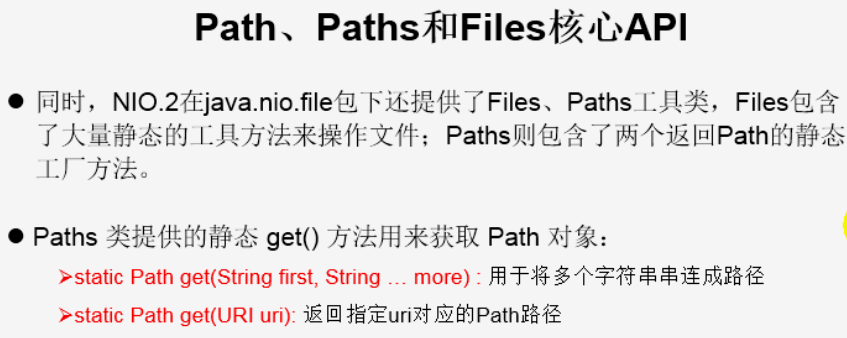

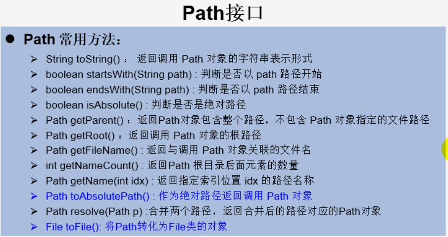

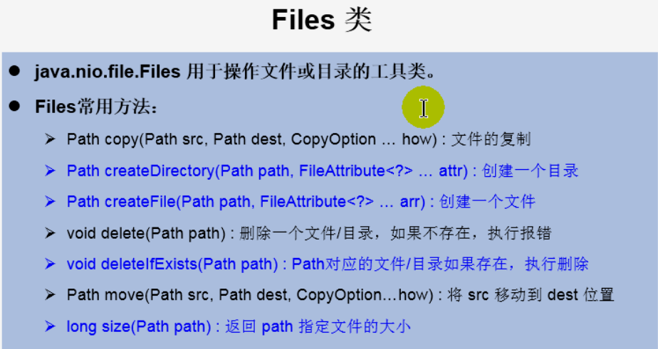

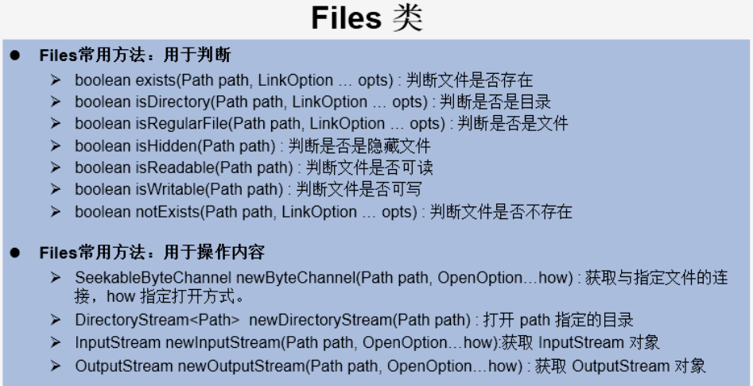

