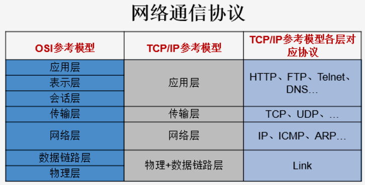
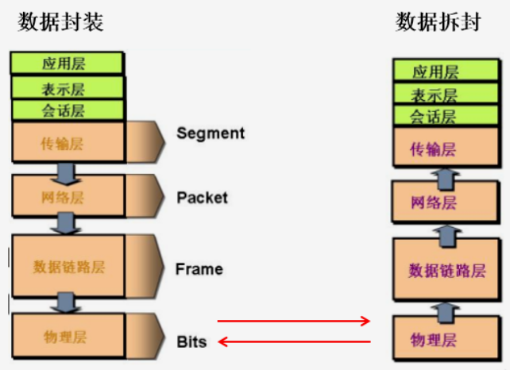
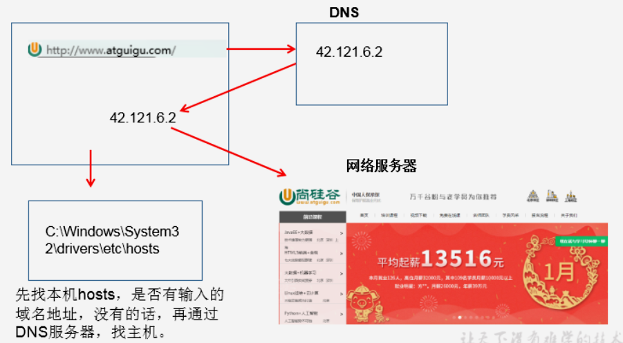
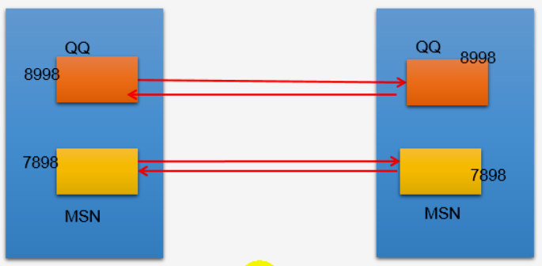
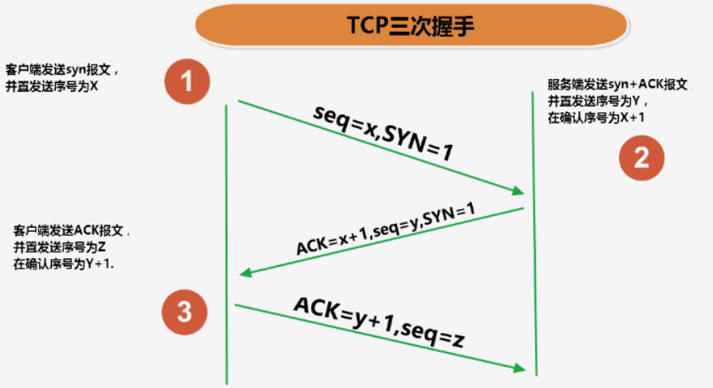
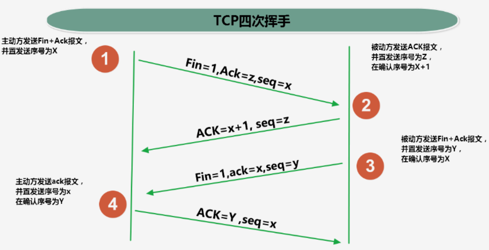

## 第14章 网络编程

### 1 网络编程概述

* Java是Internet 上的语言，它从语言级别上提供了对网络应用程序的支持，程序员能够很容易开发常见网络应用程序。

* Java提供的网络类库，可以实现无痛的网络连接，联网的底层细节被隐藏在Java的本机安装系统里，由JVM进行控制。并且Java实现了一个跨平台的网络库，<font color=blue>**程序员面对的是一个统一的网络编程环境**</font>。

* 网络基础

  * 计算机网络

    把分布在不同地理区域的计算机与专门的外部设备用通信线路互联成一个规模大、功能强的网络系统，从而使众多的计算机可以方便地相互传递信息、共享硬件、软件、数据信息等资源。

  * 网络编程的目的

    <font color=blue>**直接或间接地通过网络协议与其他计算机实现数据交换，进行通讯**</font>。

  * 网络编程中存在的两个主要问题：

    * <font color=blue>**如何准确地定位网络上的一台或多台主机；定位主机上特定的应用**</font>。
    * <font color=blue>**找到主机后如何可靠高效地进行数据传输**</font>。

### 2 网络通信要素概述

* IP和端口号

* 网络通信协议

* <font color=red>**双方通信地址**</font>

  * <font color=blue>**IP**</font>
  * <font color=blue>**端口号**</font>

* <font color=red>**一定的规则**</font>（即：网络通信协议。有两套参考模型）

  * <font color=blue>**OSI参考模型**</font>：模型过于理想化，未能在因特网上进行广泛推广

  * <font color=blue>**TCP/IP参考模型（或TCP/IP协议）**</font>：事实上的国际标准

    

    

    

### 3 通信要素1：IP和端口号

* IP地址：InetAddress

  * 唯一的标识Internet上的计算机（通信实体）

  * 本地回环地址（hostAddress）：127.0.0.1        主机名：localhost

  * IP地址分类方式1：<font color=red>**IPv4**</font>和<font color=red>**IPv6**</font>

    * IPv4：4个字节组成。4个0~255。大概42亿个，30亿都在北美，亚洲4亿。2011年初已经用尽。以点分十进制标识，如92.168.0.1
    * IPv6：128位（16个字节），写成8个无符号整数，每个整数用四个16进制位表示，数之间用冒号（：）分开，如3ffe:3201:1401:1280:c8ff:fe4d:db39:1984

  * IP地址分类方式2：<font color=red>**公网地址（万维网地址）**</font>和<font color=red>**私有地址（局域网使用）**</font>。192.168.开头的就是私有地址，范围即192.168.0.0~192.168.255.255，专门为组织机构内部使用。

  * 特点：不易记忆

    

---

* Java中InetAddress的使用

  ```java
  /*
  * 如何实例化InetAddress:两个方法：getByName(String host) 、 getLocalHost()
   *          两个常用方法：getHostName() / getHostAddress()
   */
  public class InetAddressTest {
  
      public static void main(String[] args) {
          try {
              //File file = new File("hello.txt");
              InetAddress inet1 = InetAddress.getByName("192.168.10.14");
  
              System.out.println(inet1);
  
              InetAddress inet2 = InetAddress.getByName("www.baidu.com");
              System.out.println(inet2);
  
              InetAddress inet3 = InetAddress.getByName("127.0.0.1");
              System.out.println(inet3);
  
              //获取本地ip
              InetAddress inet4 = InetAddress.getLocalHost();
              System.out.println(inet4);
  
              //getHostName()
              System.out.println(inet2.getHostName());
              //getHostAddress()
              System.out.println(inet2.getHostAddress());
  
          } catch (UnknownHostException e) {
              e.printStackTrace();
          }
      }
  }
  ```

  结果：

  ​			/192.168.10.14

  ​			www.baidu.com/182.61.200.7

  ​			/127.0.0.1

  ​			WXX/172.17.82.113

  ​			www.baidu.com

  ​			182.61.200.7

---

* 端口号
  * 标识正在计算机上运行的进程
  * 不同的进程有不同的端口号
  * 被规定为一个16位的整数 0~65535。
  * 端口分类
    * <font color=red>**公认端口**</font>：0~1023。被预先定义的服务通信占用（如：HTTP占用端口80，FTP占用端口21，Telnet占用端口23）
    * <font color=red>**注册端口**</font>：1024~49151。分配给用户进程或者应用程序。（如Tomcat占用端口号8080，MySQL占用端口3306，Oracle占用端口1521等）。
    * <font color=red>**动态/私有端口**</font>：49152~65535
  * <font color=blue>**端口号和IP地址组合得出一个网络套接字：Socket**</font>。

---



### 4 通信要素2：网络协议

* 网络通信协议

  计算机网络中实现通信必须有一些约定，即通信协议，<font color=blue>**对速率、传输代码、代码结构、传输控制步骤、出错控制等制定标准**</font>。

* 问题：网络协议太复杂

  计算机网络通信涉及的内容太多，比如制定源地址和目的地址，加密解密，压缩解压缩，差错控制，流量控制，路由控制，如何实现如此复杂的网络协议呢？

* 通信协议分层的思想

  在制定协议时，把复杂成份分解成一些简单的成份，再将它们符合起来。最常用的复合方式是层次方式，即<font color=blue>**同层间可以相互通信、上一层可以调用下一层，而与再下一层不发生关系**</font>。各层之间互不影响，利于系统的开发和拓展。
  
* TCP/IP协议簇

  * 传输层协议中有两个非常重要的协议：
    * 传输控制协议TCP（Transmission Control Protocol）
    * 用户数据报协议UDP（User Datagram Protocol）
  * <font color=blue>**TCP/IP 以有两个主要协议：传输控制协议TCP 和 网络互连协议IP **</font>而得名，实际上是一组协议，包括多个具有不同功能且互为关联的协议。
  * IP（Internet Protocol）协议时网络层的主要协议，支持网间互连的数据通信。
  * TCP/IP协议模型从实用的角度出发，形成了高效的四层体系结构，即<font color=blue>**物理链路层、IP层、传输层和应用层 **</font>。

* **TCP 和 UDP**

  * <font color=red>**TCP协议 **</font>

    * 实使用TCP协议前，须先建立TCP连接，形成传输数据通道

    * 传输前，采用“三次握手”方式，点对点通信，<font color=red>**是可靠的 **</font>

      

    * TCP协议进行通信的两个应用进程：客户端、服务端

    * 在连接中<font color=red>**进行大数据量的传输 **</font>

    * 传输完毕，<font color=red>**采用“四次挥手”释放已建立的链接，效率低 **</font>

      

  * <font color=red>**UDP协议 **</font>

    * 将数据、源、目的封装成数据包，<font color=red>**不需要建立连接 **</font>
    * 每个数据报的大小限制在64K内
    * 发送不管对方是否准备好，接收方收到也不缺人，故是不可靠的
    * 可以广播发送
    * 发送数据结束时<font color=red>**无需释放资源，开销小，速度快 **</font>

### 5 TCP网络编程

* 例子1：客户端发送信息给服务端，服务端将数据显示在控制台上

  ```java
  public class TCPTest1 {
  
      // 客户端
      // 这里涉及到的异常，应该使用try-catch-finally处理
      @Test
      public void client() throws IOException {
          // 1.创建Socket对象，指明服务器端的ip和端口号
          InetAddress inet = InetAddress.getLocalHost();
          Socket socket = new Socket(inet, 8899);
          // 2.获取一个输出流，用于输出数据
          OutputStream os = socket.getOutputStream();
          // 3.写出数据的操作
          os.write("你好，我是客户端mm".getBytes());
          // 4.资源的关闭
          os.close();
          socket.close();
      }
  
      // 服务端
      // 这里涉及到的异常，应该使用try-catch-finally处理
      @Test
      public void server() throws IOException {
          // 1.创建服务器端的ServerSocket，指明自己的端口号
          ServerSocket ss = new ServerSocket(8899);
          // 2.调用accept()表示接收来自于客户端的socket
          Socket socket = ss.accept();
          // 3.获取输入流
          InputStream is = socket.getInputStream();
  
          // 不建议这样写，可能会有乱码
  //        byte[] buffer = new byte[1024];
  //        int len;
  //        while((len = is.read(buffer)) != -1){
  //            String str = new String(buffer,0,len);
  //            System.out.print(str);
  //        }
          // 4.读取输入流中的数据
          ByteArrayOutputStream baos = new ByteArrayOutputStream();
          byte[] buffer = new byte[5];
          int len;
          while ((len = is.read(buffer)) != -1) {
              baos.write(buffer, 0, len);
          }
          System.out.println(baos.toString());
          System.out.println("收到了来自于：" + socket.getInetAddress().getHostAddress() + "的数据");
          //5.关闭资源
          baos.close();
          is.close();
          socket.close();
          ss.close();
      }
  }
  ```

* 例子2：客户端发送文件给服务端，服务端将文件保存在本地。

  ```java
  public class TCPTest2 {
  
      // 这里涉及到的异常，应该使用try-catch-finally处理
      @Test
      public void client() throws IOException {
          // 1.创建socket
          Socket socket = new Socket(InetAddress.getByName("127.0.0.1"), 9090);
          // 2.创建输入流，将文件读入内存
          FileInputStream fis = new FileInputStream(new File("beauty.jpg"));
          // 3.获取输出流，通过该输出流将数据发出去
          OutputStream os = socket.getOutputStream();
          // 4.将内存中的数据发送出去（即写入到输出流中）
          byte[] buffer = new byte[1024];
          int len;
          while ((len = fis.read(buffer)) != -1) {
              os.write(buffer, 0, len);
          }
          // 5.关闭资源
          fis.close();
          os.close();
          socket.close();
      }
  
      // 这里涉及到的异常，应该使用try-catch-finally处理
      @Test
      public void server() throws IOException {
          // 1.创建socket
          ServerSocket ss = new ServerSocket(9090);
          // 2.调用accept()表示接收来自于客户端的socket
          Socket socket = ss.accept();
          // 3.获取输入流，接收客户端发送来的数据
          InputStream is = socket.getInputStream();
          // 4.创建输出流，将数据写入到磁盘中
          FileOutputStream fos = new FileOutputStream(new File("beauty1.jpg"));
          // 5.将内存中的数据写入磁盘
          byte[] buffer = new byte[1024];
          int len;
          while ((len = is.read(buffer)) != -1) {
              fos.write(buffer, 0, len);
          }
          // 6.关闭资源
          fos.close();
          is.close();
          socket.close();
          ss.close();
      }
  }
  ```

* 例子3：从客户端发送文件给服务端，服务端保存到本地。并返回“发送成功”给客户端。并关闭相应的连接。

  ```java
  public class TCPTest3 {
  
      // 这里涉及到的异常，应该使用try-catch-finally处理
      @Test
      public void client() throws IOException {
          // 1.创建socket
          Socket socket = new Socket(InetAddress.getByName("127.0.0.1"), 9090);
          // 2.创建输入流，将文件读入内存
          FileInputStream fis = new FileInputStream(new File("beauty.jpg"));
          // 3.获取输出流，通过该输出流将数据发出去
          OutputStream os = socket.getOutputStream();
          // 4.将内存中的数据发送出去（即写入到输出流中）
          byte[] buffer = new byte[1024];
          int len;
          while ((len = fis.read(buffer)) != -1) {
              os.write(buffer, 0, len);
          }
          // 关闭数据的输出，这里发生了阻塞，必须调用这句话
          socket.shutdownOutput();
  
          // 5.接收来自于服务器端的数据，并显示到控制台上
          InputStream is = socket.getInputStream();
          ByteArrayOutputStream baos = new ByteArrayOutputStream();
          byte[] bufferr = new byte[20];
          int len1;
          while ((len1 = is.read(buffer)) != -1) {
              baos.write(buffer, 0, len1);
          }
          System.out.println(baos.toString());
          // 6.关闭资源
          fis.close();
          os.close();
          socket.close();
          baos.close();
      }
  
      // 这里涉及到的异常，应该使用try-catch-finally处理
      @Test
      public void server() throws IOException {
          // 1.创建socket
          ServerSocket ss = new ServerSocket(9090);
          // 2.调用accept()表示接收来自于客户端的socket
          Socket socket = ss.accept();
          // 3.获取输入流，接收客户端发送来的数据
          InputStream is = socket.getInputStream();
          // 4.创建输出流，将数据写入到磁盘中
          FileOutputStream fos = new FileOutputStream(new File("beauty2.jpg"));
          // 5.将内存中的数据写入磁盘
          byte[] buffer = new byte[1024];
          int len;
          while ((len = is.read(buffer)) != -1) {
              fos.write(buffer, 0, len);
          }
          System.out.println("图片传输完成");
          // 6.服务器端给予客户端反馈
          OutputStream os = socket.getOutputStream();
          os.write("你好，美女，照片我已收到，非常漂亮！".getBytes());
          // 7.关闭资源
          fos.close();
          is.close();
          socket.close();
          ss.close();
          os.close();
      }
  }
  ```

  

### 6 UDP网络编程

* 例子：客户端发送信息给服务端，服务端将数据显示在控制台上

  ```java
  public class UDPTest {
  
      //发送端
      @Test
      public void sender() throws IOException {
          // 封装数据报 DatagramPacket
          String str = "我是UDP方式发送的导弹";
          byte[] data = str.getBytes();
          InetAddress inet = InetAddress.getLocalHost();
          DatagramPacket packet = new DatagramPacket(data, 0, data.length, inet, 9090);
  
          // 将数据通过socket发送出去
          DatagramSocket socket = new DatagramSocket();
          socket.send(packet);
          socket.close();
      }
  
      //接收端
      @Test
      public void receiver() throws IOException {
          // 创建接收数据的 DatagramPacket
          byte[] buffer = new byte[100];
          DatagramPacket packet = new DatagramPacket(buffer, 0, buffer.length);
          // 创建socket, 接收数据
          DatagramSocket socket = new DatagramSocket(9090);
          socket.receive(packet);
          // 输出接收到的数据
          System.out.println(new String(packet.getData(), 0, packet.getLength()));
          // 关闭socket
          socket.close();
      }
  }
  ```

### 7 URL编程

```java
/**
 * URL网络编程
 * 1.URL:统一资源定位符，对应着互联网的某一资源地址
 * 2.格式：
 *  http://localhost:8080/examples/beauty.jpg?username=Tom
 *  协议   主机名    端口号  资源地址           参数列表
 */
public class URLTest {

    public static void main(String[] args) {
        try {
            URL url = new URL("http://localhost:8080/examples/beauty.jpg?username=Tom");

            System.out.println(url.getProtocol());  // 获取该URL的协议名
            System.out.println(url.getHost());  // 获取该URL的主机名
            System.out.println(url.getPort());  // 获取该URL的端口号
            System.out.println(url.getPath());  // 获取该URL的文件路径
            System.out.println(url.getFile());  // 获取该URL的文件名
            System.out.println(url.getQuery());  // 获取该URL的查询名
        } catch (MalformedURLException e) {
            e.printStackTrace();
        }
    }
}
```

**结果：**

​			http

​			localhost

​			8080

​			/examples/beauty.jpg

​			/examples/beauty.jpg?username=Tom

​			username=Tom

---

* 例子：将网络上的资源下载到本地

  ```java
  public class URLTest1 {
  
      public static void main(String[] args) {
  
          HttpURLConnection urlConnection = null;
          InputStream is = null;
          FileOutputStream fos = null;
          try {
              // 创建 URL
              URL url = new URL("http://localhost:8080/examples/beauty.jpg");
              urlConnection = (HttpURLConnection) url.openConnection();
              // 获取连接
              urlConnection.connect();
              // 获取输入流
              is = urlConnection.getInputStream();
              // 创建输出流，将网络上的资源下载到本地
              fos = new FileOutputStream("day10\\beauty4.jpg");
              // 将数据下载到本地
              byte[] buffer = new byte[1024];
              int len;
              while ((len = is.read(buffer)) != -1) {
                  fos.write(buffer, 0, len);
              }
              System.out.println("下载完成");
          } catch (IOException e) {
              e.printStackTrace();
          } finally {
              // 关闭资源
              if (is != null) {
                  try {
                      is.close();
                  } catch (IOException e) {
                      e.printStackTrace();
                  }
              }
              if (fos != null) {
                  try {
                      fos.close();
                  } catch (IOException e) {
                      e.printStackTrace();
                  }
              }
              if (urlConnection != null) {
                  urlConnection.disconnect();
              }
          }
      }
  }
  ```

